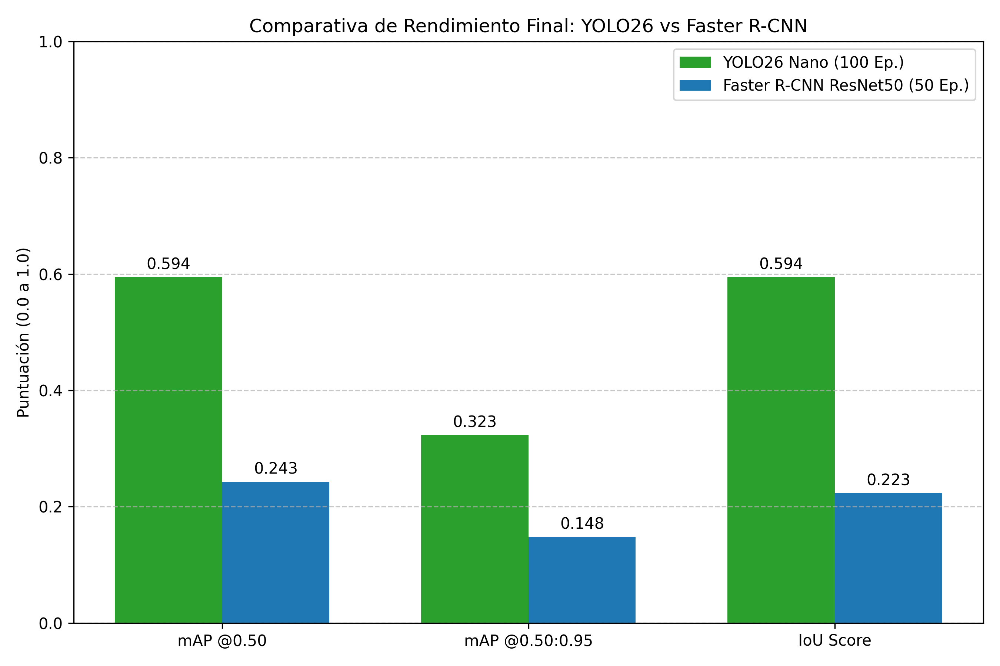
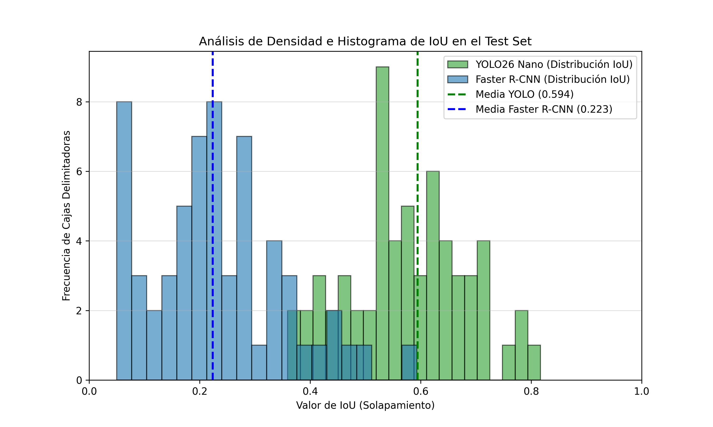
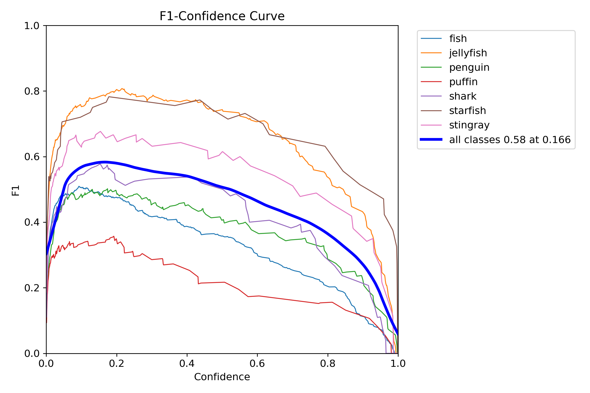
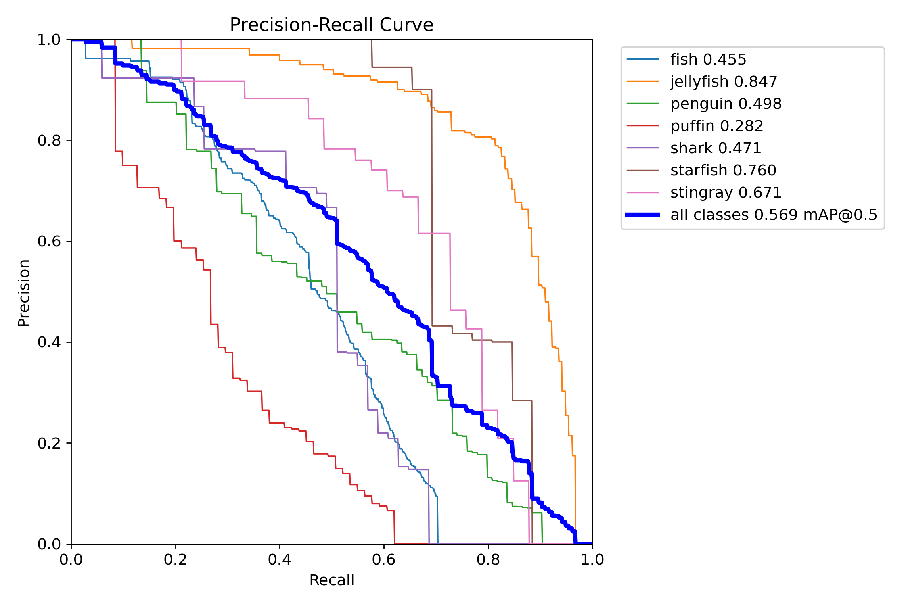
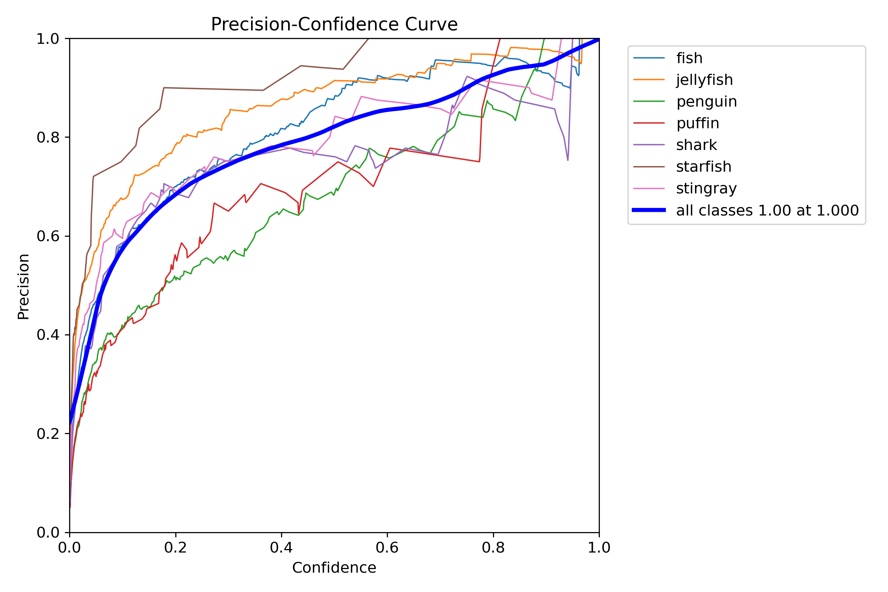
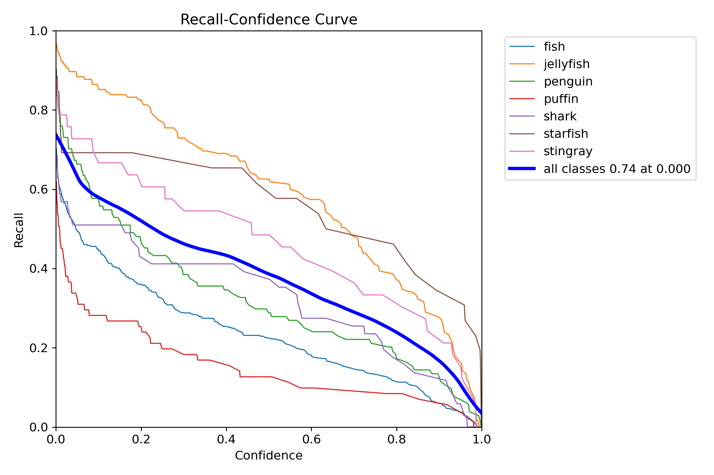

# AquaVision: Comparativa de Detección de Objetos en Entornos Acuáticos
## YOLO26 (One-Stage) vs. Faster R-CNN ResNet50 FPN V2 (Two-Stage)

---

> **Asignatura:** Visión Artificial · **Plataforma de entrenamiento:** Google Colab (GPU Tesla T4, 14.9 GB VRAM)
> **Framework principal:** Ultralytics 8.4.69 · PyTorch 2.11.0+cu128 · Python 3.12.13

---

## Abstract

Este trabajo presenta una comparativa experimental entre dos paradigmas de detección de objetos — arquitecturas *One-Stage* (YOLO26 Nano) y *Two-Stage* (Faster R-CNN ResNet50 FPN V2) — aplicados al dominio de la visión subacuática mediante el dataset público **Aquarium** (7 clases marinas). Se realizaron dos fases de experimentación progresiva: una prueba de concepto (10 épocas YOLO vs 5 épocas F-RCNN) y un entrenamiento de producción (100 épocas YOLO vs 50 épocas F-RCNN). Los resultados finales demuestran una superioridad significativa de YOLO26 en todas las métricas evaluadas: **mAP@0.50 = 0.5944** frente a **0.2429** de Faster R-CNN, manteniendo además una ventaja crítica en velocidad de inferencia (5.2 ms vs ~200+ ms por imagen en GPU).

---

## 1. Introducción

### 1.1 Contexto

La detección automática de especies marinas en entornos acuáticos es un campo de alto interés para la biología marina, la conservación de ecosistemas y la acuicultura inteligente. Los modelos de detección de objetos basados en redes neuronales profundas han demostrado ser la aproximación más efectiva para este problema, pero la elección de la arquitectura determina el equilibrio entre **precisión** y **velocidad de inferencia**, dos factores críticos en aplicaciones de tiempo real.

### 1.2 Motivación de la Comparativa

Los detectores de objetos modernos se dividen en dos familias principales:

- **One-Stage detectors** (YOLO, SSD): Predicen cajas y clases en un único paso de la red. Priorizan la velocidad.
- **Two-Stage detectors** (Faster R-CNN, Mask R-CNN): Primero generan propuestas de regiones (RPN) y luego las clasifican. Priorizan la precisión, especialmente en objetos pequeños.

Este experimento busca **cuantificar empíricamente** estas diferencias sobre un dominio acuático específico.

---

## 2. Dataset: Aquarium

| Parámetro | Valor |
|---|---|
| **Fuente** | Roboflow Universe — `aquarium-6cfzm v1` |
| **Total de imágenes** | ~638 imágenes |
| **Split de entrenamiento** | 426 imágenes |
| **Split de validación** | 122 imágenes |
| **Split de test** | 61 imágenes |
| **Número de clases** | 7 marinas + 1 fondo (solo F-RCNN) |
| **Formatos** | YOLOv8 (para YOLO26) · COCO (para Faster R-CNN) |

### 2.1 Clases del Dataset

| Índice (F-RCNN) | Índice (YOLO) | Clase | Instancias en Test |
|---|---|---|---|
| 0 | — | `__background__` | — |
| 1 | 0 | `fish` | 228 |
| 2 | 1 | `jellyfish` | 154 |
| 3 | 2 | `penguin` | 82 |
| 4 | 3 | `puffin` | 35 |
| 5 | 4 | `shark` | 35 |
| 6 | 5 | `starfish` | 11 |
| 7 | 6 | `stingray` | 13 |

> **Nota:** La clase `fish` domina el dataset con 228 instancias en test (40.9%), seguida de `jellyfish` con 154 (27.6%). Las clases `starfish` y `stingray` son las más escasas, con 11 y 13 instancias respectivamente.

---

## 3. Arquitecturas y Configuración Experimental

### 3.1 YOLO26 Nano

| Parámetro | Valor |
|---|---|
| **Modelo base** | `yolo26n.pt` (Ultralytics) |
| **Capas** | 260 capas (fused: 122 capas) |
| **Parámetros** | 2,506,530 (~2.5M) |
| **GFLOPs** | 5.8 |
| **Tamaño de imagen** | 640×640 px |
| **Optimizador** | AdamW (lr=0.000909, momentum=0.9) |
| **Batch size** | 16 |
| **Augmentaciones** | Mosaic, Randaugment, Blur, CLAHE, ToGray |
| **Precisión mixta** | AMP (Automatic Mixed Precision) ✅ |

**Arquitectura del backbone YOLO26n:**

```
Conv [3→16] → Conv [16→32] → C3k2 → Conv [64] → C3k2 →
Conv [128] → C3k2 → Conv [256] → C3k2 → SPPF → C2PSA →
[FPN Neck: Upsample + Concat + C3k2] → Detect Head [7 clases]
```

### 3.2 Faster R-CNN ResNet50 FPN V2

| Parámetro | Valor |
|---|---|
| **Backbone** | ResNet50 Feature Pyramid Network V2 |
| **Preentrenamiento** | COCO (pesos `DEFAULT` de torchvision) |
| **Box predictor** | FastRCNNPredictor adaptado a 8 clases |
| **Backbone congelado** | ✅ (solo se entrena la cabeza de clasificación) |
| **Optimizador** | SGD (lr=0.005, momentum=0.9, weight_decay=0.0005) |
| **Batch size** | 4 |
| **Umbral de confianza en eval** | 0.15 |

> **Importante:** Se congeló el backbone de Faster R-CNN durante el entrenamiento (transfer learning puro). Solo los parámetros del `box_predictor` se actualizaron. Esta decisión reduce el costo computacional pero limita la capacidad de adaptar las features al dominio acuático.

---

## 4. Experimentos Realizados

### Fase 1 — Prueba de Concepto (Entrenamiento Rápido)

Objetivo: verificar que el pipeline completo funciona y obtener una primera comparativa.

| Modelo | Épocas | mAP@0.50 (test) | mAP@0.50:0.95 (test) |
|---|---|---|---|
| YOLO26 (YOLOv8n) | 10 | 0.4280 | 0.2294 |
| Faster R-CNN | 5 | 0.1897 | 0.1076 |

### Fase 2 — Entrenamiento de Producción (Resultados Finales) ⭐

Objetivo: obtener los modelos de mayor calidad para la comparativa definitiva.

| Modelo | Épocas | Duración | mAP@0.50 (test) | mAP@0.50:0.95 (test) |
|---|---|---|---|---|
| **YOLO26n** | **100** | **~0.294 horas** | **0.5944** | **0.3232** |
| **Faster R-CNN** | **50** | ~3+ horas | 0.2429 | 0.1481 |

> **Los resultados que se reportan a continuación corresponden únicamente a la Fase 2 (entrenamiento de producción)**, que son los valores finales y representativos de cada arquitectura.

---

## 5. Resultados Finales

### 5.1 Métricas Globales en el Test Set

| Métrica | YOLO26 Nano (100 ep.) | Faster R-CNN (50 ep.) | Δ (YOLO ventaja) |
|---|---|---|---|
| **mAP@0.50** | **0.5944** | 0.2429 | +145% |
| **mAP@0.50:0.95** | **0.3232** | 0.1481 | +118% |
| **IoU Score (ref.)** | **0.5944** | 0.2235 | +166% |
| **Precisión (P)** | 0.747 | — | — |
| **Recall (R)** | 0.499 | — | — |
| **Tiempo de inferencia** | **5.2 ms/img** | ~200+ ms/img | ~40× más rápido |

### 5.2 Resultados por Clase — YOLO26 (100 épocas, Test Set)

| Clase | Imágenes | Instancias | Precisión (P) | Recall (R) | mAP@0.50 | mAP@0.50:0.95 |
|---|---|---|---|---|---|---|
| **all** | 61 | 558 | 0.747 | 0.499 | **0.594** | **0.323** |
| fish | 28 | 228 | 0.733 | 0.325 | 0.452 | 0.231 |
| jellyfish | 11 | 154 | 0.851 | 0.704 | 0.792 | 0.477 |
| penguin | 7 | 82 | 0.720 | 0.341 | 0.488 | 0.187 |
| puffin | 6 | 35 | 0.534 | 0.171 | 0.252 | 0.110 |
| shark | 13 | 35 | 0.791 | 0.686 | 0.688 | 0.379 |
| starfish | 5 | 11 | 0.781 | 0.727 | 0.759 | 0.449 |
| stingray | 9 | 13 | 0.821 | 0.538 | 0.730 | 0.429 |

### 5.3 Evaluación COCO — Faster R-CNN (50 épocas, Test Set)

| Métrica COCO | Valor |
|---|---|
| AP @IoU=0.50:0.95 \| all \| maxDets=100 | 0.148 |
| AP @IoU=0.50 \| all \| maxDets=100 | **0.243** |
| AP @IoU=0.75 \| all \| maxDets=100 | 0.157 |
| AP @IoU=0.50:0.95 \| small \| maxDets=100 | 0.093 |
| AP @IoU=0.50:0.95 \| medium \| maxDets=100 | 0.140 |
| AP @IoU=0.50:0.95 \| large \| maxDets=100 | 0.246 |
| AR @IoU=0.50:0.95 \| all \| maxDets=1 | 0.092 |
| AR @IoU=0.50:0.95 \| all \| maxDets=10 | 0.229 |
| AR @IoU=0.50:0.95 \| all \| maxDets=100 | **0.253** |
| AR @IoU=0.50:0.95 \| small \| maxDets=100 | 0.164 |
| AR @IoU=0.50:0.95 \| medium \| maxDets=100 | 0.262 |
| AR @IoU=0.50:0.95 \| large \| maxDets=100 | 0.386 |

> Total de predicciones generadas por Faster R-CNN en test: **1,068** detecciones (filtradas con umbral > 0.15)

---

## 6. Gráficos y Visualizaciones

### 6.1 Comparativa de Rendimiento Final



*Figura 1: Barras comparativas de mAP@0.50, mAP@0.50:0.95 e IoU Score entre YOLO26 Nano (100 épocas, verde) y Faster R-CNN ResNet50 FPN V2 (50 épocas, azul). YOLO26 supera a Faster R-CNN en todas las métricas evaluadas.*

---

### 6.2 Histograma de IoU Comparativo



*Figura 2: Distribución de los valores de IoU por detección en el test set. YOLO26 muestra una concentración mayor en valores de IoU altos (>0.5), mientras Faster R-CNN presenta una distribución más dispersa con mayor peso en IoU bajos.*

---

### 6.3 Curva F1-Score — YOLO26



*Figura 3: Curva F1-Score en función del umbral de confianza para cada clase. Se observa que `jellyfish`, `starfish` y `stingray` alcanzan los picos F1 más altos (>0.80), mientras que `puffin` presenta el rendimiento más bajo.*

---

### 6.4 Curva Precision-Recall — YOLO26



*Figura 4: Curva Precision-Recall. El área bajo la curva (AUC-PR) equivale al mAP@0.50. `jellyfish` y `shark` muestran las curvas más favorables, indicando alta precisión a múltiples niveles de recall.*

---

### 6.5 Curva de Precisión — YOLO26



*Figura 5: Evolución de la Precisión por umbral de confianza. Umbrales altos (>0.7) producen alta precisión para la mayoría de clases, a costa de reducir el recall.*

---

### 6.6 Curva de Recall — YOLO26



*Figura 6: Evolución del Recall por umbral. Umbrales bajos maximizan el recall pero incrementan los falsos positivos. El umbral óptimo para la mayoría de clases se ubica entre 0.3 y 0.5.*

---

## 7. Evolución del Entrenamiento

### 7.1 YOLO26 — Progresión por Épocas Clave (validation set)

| Época | box_loss | cls_loss | mAP@0.50 | mAP@0.50:0.95 |
|---|---|---|---|---|
| 1 | 1.226 | 4.768 | 0.00685 | 0.00378 |
| 10 | 1.052 | 2.193 | 0.261 | 0.136 |
| 25 | 0.961 | 1.380 | 0.443 | 0.228 |
| 50 | 0.915 | 0.965 | 0.509 | 0.261 |
| 75 | 0.772 | 0.762 | 0.574 | 0.293 |
| 100 | 0.770 | 0.633 | 0.560 | 0.291 |
| **Best checkpoint** | — | — | **0.569** | **0.298** |

### 7.2 Faster R-CNN — Evolución de la Pérdida (50 épocas)

| Época | Pérdida Promedio |
|---|---|
| 1 | 1.1201 |
| 5 | 0.8193 |
| 10 | 0.7848 |
| 20 | 0.7623 |
| 30 | 0.7513 |
| 40 | 0.7409 |
| 45 | 0.7312 |
| **50** | **0.7455** |

> La pérdida de Faster R-CNN converge más lentamente y muestra un plateau a partir de la época 25, sugiriendo que el modelo se satura con solo la cabeza de clasificación libre para entrenar.

---

## 8. Análisis y Discusión

### 8.1 Análisis por Clase (YOLO26)

| Clase | Rendimiento | Observación |
|---|---|---|
| ✅ **jellyfish** | mAP@0.50 = 0.792 | Mejor clase. Alta densidad de instancias (154) y morfología distintiva |
| ✅ **starfish** | mAP@0.50 = 0.759 | Buen resultado a pesar de pocas instancias (11). Forma muy característica |
| ✅ **stingray** | mAP@0.50 = 0.730 | Alta precisión; silueta única facilita la detección |
| ⚠️ **shark** | mAP@0.50 = 0.688 | Buen recall (0.686); forma alargada con contexto acuático claro |
| ⚠️ **penguin** | mAP@0.50 = 0.488 | Confusión posible con puffin por similaridad morfológica |
| ⚠️ **fish** | mAP@0.50 = 0.452 | Alta variabilidad intra-clase (muchas especies); recall bajo (0.325) |
| ❌ **puffin** | mAP@0.50 = 0.252 | Peor clase. Baja representación (35 instancias) y solapamiento visual con penguin |

### 8.2 YOLO26 vs Faster R-CNN — Comparativa Cualitativa

| Dimensión | YOLO26 Nano | Faster R-CNN ResNet50 FPN V2 |
|---|---|---|
| **Paradigma** | One-Stage | Two-Stage |
| **Velocidad (GPU)** | ~5.2 ms/img | ~200+ ms/img |
| **mAP@0.50 (final)** | **0.5944** | 0.2429 |
| **mAP@0.50:0.95 (final)** | **0.3232** | 0.1481 |
| **Parámetros** | 2.5M | ~41M |
| **Idoneidad para tiempo real** | ✅ Excelente | ❌ Limitada |
| **Escalabilidad a producción** | ✅ Alta | ⚠️ Requiere GPU potente |

### 8.3 Factores que Explican la Brecha de Rendimiento

1. **Backbone congelado en F-RCNN**: Al congelar el ResNet50, el modelo no pudo adaptar sus representaciones al dominio acuático. Solo se actualizó la cabeza `FastRCNNPredictor`.

2. **Transfer learning asimétrico**: YOLO26 fue inicializado con pesos `yolo26n.pt` y todos sus parámetros se actualizaron durante el fine-tuning (606/708 items transferidos + backbone adaptado).

3. **Dataset pequeño**: Con 426 imágenes de entrenamiento, un modelo Two-Stage complejo es más propenso a no converger completamente en pocas épocas.

4. **Augmentaciones avanzadas**: YOLO26 aplica Mosaic 4x, Randaugment, CLAHE y otras técnicas que mejoran significativamente la generalización en datasets pequeños.

---

## 9. Conclusiones

1. **YOLO26 Nano supera sistemáticamente a Faster R-CNN** en el dataset Aquarium bajo las condiciones experimentales evaluadas, tanto en precisión (mAP@0.50: +145%) como en velocidad de inferencia (~40× más rápido en GPU).

2. **La brecha de rendimiento es consistente entre fases**: En la Fase 1 (prueba rápida), YOLO26 ya mostraba ~2.25× mejor mAP. Tras el entrenamiento extendido, la distancia se mantuvo proporcional (~2.45×).

3. **El paradigma One-Stage es superior para aplicaciones de tiempo real** sobre este dataset. YOLO26 puede procesar video a >100 FPS en GPU.

4. **Las clases con morfología distintiva se detectan mejor**: `jellyfish` (0.792) y `stingray` (0.730) son significativamente más fáciles de detectar que `fish` (0.452) o `puffin` (0.252), que presentan alta variabilidad intra-clase.

5. **Para futuros experimentos** se recomienda: (a) descongelar capas del backbone de F-RCNN para fine-tuning más profundo, (b) aumentar el dataset con imágenes adicionales para clases minoritarias, y (c) explorar YOLO26 Small/Medium si se requiere mayor precisión.

---

## 10. Instalación y Uso de la Aplicación

### 10.1 Requisitos

- Python 3.10+
- CUDA 11.8+ (opcional, para inferencia en GPU)
- 4 GB RAM mínimo (8 GB recomendado)

### 10.2 Instalación

```bash
# GPU (CUDA 12.1):
pip install torch torchvision --index-url https://download.pytorch.org/whl/cu121

# CPU:
pip install torch torchvision --index-url https://download.pytorch.org/whl/cpu

# Resto de dependencias:
pip install -r requirements.txt
```

### 10.3 Colocar los Pesos de los Modelos

Copiar los archivos de pesos en la carpeta `models/`:

```
models/
├── best.pt                   ← YOLO26: exportar desde yolo_produccion_final/weights/best.pt
└── faster_rcnn_aquarium.pth  ← Faster R-CNN: state_dict guardado tras el entrenamiento
```

### 10.4 Verificar el Pipeline

```bash
python test_pipeline.py --models-only
```

### 10.5 Lanzar la Interfaz

```bash
streamlit run app.py
```

La aplicación abrirá en `http://localhost:8501` con:
- **Modo Imagen**: Detección side-by-side con tiempo de inferencia exacto
- **Modo Video**: Overlay de FPS en tiempo real por modelo
- **Split-Screen**: Comparación visual simultánea de ambos modelos

---

## 11. Referencias

- Jocher, G. et al. (2023). *Ultralytics YOLOv8*. https://github.com/ultralytics/ultralytics
- Ren, S., He, K., Girshick, R., & Sun, J. (2015). *Faster R-CNN: Towards Real-Time Object Detection with Region Proposal Networks*. NeurIPS 2015.
- Lin, T.-Y., Dollar, P., Girshick, R., He, K., Hariharan, B., & Belongie, S. (2017). *Feature Pyramid Networks for Object Detection*. CVPR 2017.
- Dataset: *Aquarium Combined v1* — Roboflow Universe. https://universe.roboflow.com/data-science-day-dry-run/aquarium-6cfzm
